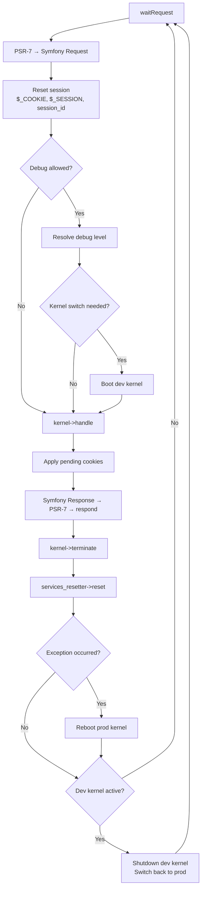

# RoadRunner Worker for Symfony

Reusable HTTP worker for running Symfony applications on [RoadRunner](https://roadrunner.dev/) in Kubernetes.

## Quick Start

### Minimal (production only, no debug switching)

```php
<?php // public/worker.php
declare(strict_types=1);

use VysokeSkoly\UtilsBundle\RoadRunner\RoadRunnerWorker;
use App\Kernel;

require __DIR__ . '/../vendor/autoload.php';

RoadRunnerWorker::build(fn(string $env, bool $debug) => new Kernel($env, $debug))
    ->run();
```

### Full (with debug mode, error controller, Istio affinity)

```php
<?php // public/worker.php
declare(strict_types=1);

use VysokeSkoly\UtilsBundle\RoadRunner\RoadRunnerWorker;
use VysokeSkoly\FrontBundle\Environment\VysokeSkoly;
use VysokeSkoly\FrontBundle\Environment\K8sEnv;
use VysokeSkoly\Kernel;

require __DIR__ . '/../vendor/autoload.php';

$vysokeSkolyApp = new VysokeSkoly(new K8sEnv());

RoadRunnerWorker::build(fn(string $env, bool $debug) => new Kernel($env, $debug))
    ->withEnvironment($vysokeSkolyApp)
    ->withDebugCookieName('vysoke_skoly_dbg')
    ->withErrorController([ErrorController::class, 'showAction'])
    ->withPendingCookiesProvider(fn() => $vysokeSkolyApp->consumePendingCookies())
    ->run();
```

## Builder API

| Method | Required | Description |
|--------|----------|-------------|
| `build(callable $factory)` | **Yes** | Kernel factory: `fn(string $env, bool $debug): KernelInterface` |
| `withEnvironment(EnvironmentInterface)` | No | Enables debug mode switching per-request |
| `withDevKernelFactory(callable)` | No | Separate factory for dev kernels (defaults to main factory) |
| `withDebugResolver(DebugLevelResolverInterface)` | No | Explicit debug resolver instance (alternative to container lookup) |
| `withDebugCookieName(string)` | No | Cookie for Istio session affinity; enables first-request redirect |
| `withErrorController(array)` | No | `[Controller::class, 'method']` for rendering nice 5xx error pages |
| `withPendingCookiesProvider(callable)` | No | Returns cookies to add to Response (`setcookie()` doesn't work in RR) |

## Environment Variables

| Variable | Default | Purpose |
|----------|---------|---------|
| `DEFAULT_URI` | `http://localhost` | Symfony router needs a base URI for URL generation |
| `TRUSTED_HOSTS` | _(none)_ | Regex pattern for allowed Host headers |
| `DEBUG_ALLOWED` | `false` | Whether debug/dev mode switching is permitted on this pod |

Trusted proxies are always set to `0.0.0.0/0` (all) because in k8s, traffic passes through Istio sidecar + ingress gateway.

## How It Works

### Request Lifecycle



### Session Handling

PHP's session state persists between requests in RoadRunner. The worker resets it on every request:

1. **`session_abort()`** — closes any lingering active session without writing
2. **`$_SESSION = []`** — prevents data leaking between users
3. **`$_COOKIE = $request->cookies->all()`** — syncs from PSR-7 (PHP doesn't read HTTP headers in RR)
4. **`session_id($cookie_value)`** — ensures `session_start()` opens the correct memcached session

Without step 4, PHP reuses the previous request's session ID, causing cross-user session leaks.

### Debug Mode Switching

When `DEBUG_ALLOWED=true` and an `EnvironmentInterface` is configured:

1. The debug level is resolved per-request (from container service or explicit resolver)
2. If debug level requires dev mode → a temporary dev kernel is booted
3. After the response, the dev kernel is shut down and prod kernel is restored
4. The prod kernel is **never** shut down during debug requests

### Istio Session Affinity (Debug Cookie)

When `withDebugCookieName()` is set:

- First `?dbg=1` request has no cookie → Istio routes randomly
- Worker responds with 302 + Set-Cookie (via pending cookies provider)
- Browser re-sends with cookie → Istio hashes cookie → same pod
- Profiler/toolbar requests also carry the cookie → land on same pod

### Error Handling

| Scenario | Behavior |
|----------|----------|
| Exception in `$kernel->handle()` | Handled by Symfony's kernel.exception event (normal) |
| Exception escapes to worker loop | Rendered via error controller (prod) or debug page (dev) |
| `die()`/`exit()`/OOM | Shutdown handler sends error response via RoadRunner |
| Exception after response sent | Logged, reported to RR as error frame |
| Kernel exception | Prod kernel rebooted for clean state on next request |

### Service Reset

After every request, `services_resetter->reset()` is called. This resets all services implementing `Symfony\Contracts\Service\ResetInterface`:

- Doctrine EntityManager (clears identity map)
- Monolog handlers (reset buffers)
- Any custom services tagged with `kernel.reset`

**Important:** Stateful listeners/services that don't implement `ResetInterface` will leak state between requests. Add `ResetInterface` to any service with mutable instance properties.

## Session Handler

For memcached sessions in RoadRunner, use a handler that does NOT call `$memcached->quit()` in `close()`:

```php
use Symfony\Component\HttpFoundation\Session\Storage\Handler\MemcachedSessionHandler;

/**
 * Extends the default MemcachedSessionHandler for RoadRunner's long-lived worker process.
 *
 * Overrides:
 *  - close(): Prevents $memcached->quit() which tears down the persistent connection.
 *  - open(): Suppresses the native Cache-Control header (useless in RoadRunner, goes to void).
 *  - write(): Skips the parent's "destroy session on empty data" logic. In RoadRunner,
 *    destroy() calls setcookie() which is a no-op and can cause subtle issues.
 *    Empty sessions are simply not persisted (return true without writing).
 */
class RoadRunnerMemcachedSessionHandler extends MemcachedSessionHandler
{
    public function open(string $savePath, string $sessionName): bool
    {
        // Skip parent's header() call — in RoadRunner there's no SAPI output buffer.
        // The parent sends Cache-Control via header() which goes to void in RR.
        return true;
    }

    public function close(): bool
    {
        return true;
    }

    /**
     * Override to prevent session destruction when data is empty.
     *
     * The parent's write() calls destroy() when session data is empty (igbinary edge case).
     * In RoadRunner, destroy() triggers setcookie() which is useless (no SAPI).
     * Instead, we simply skip writing empty sessions — they'll expire naturally via TTL.
     */
    public function write(string $sessionId, string $data): bool
    {
        // Don't persist empty sessions, but don't destroy them either
        if ($data === '' || $data === (\function_exists('igbinary_serialize') ? igbinary_serialize([]) : '')) {
            return true;
        }

        return $this->doWrite($sessionId, $data);
    }
}
```

The default `MemcachedSessionHandler::close()` tears down the connection, which corrupts the persistent connection pool in long-lived workers.

